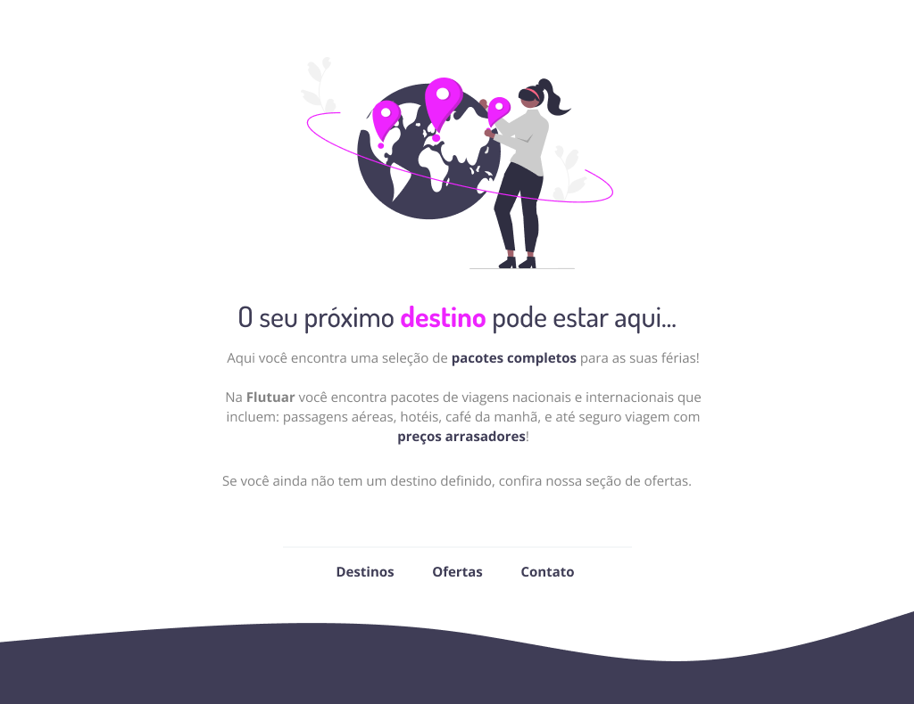

# Projeto 01 - Explorer

<h1>🖼️ Layout do projeto - Desafio 02: Projeto de Aplicação Web</h1>
<h1></h1>

Você pode visualizar o layout do projeto através <a style="border: none;" href="https://www.figma.com/file/waisYRoNzeBgIxOyrz0b2R/Projeto01-Extra/duplicate">desse link</a>. É necessário ter conta no Figma para acessá-lo.

# Conceitos Utilizados no Projeto

- Estruturando um projeto HTML;
- Uso de tags HTML mais comuns;
- Conceitos iniciais de CSS;
- Posicionamento e alinhamento de elementos na tela;
- Aplicando fontes customizadas;
- Espaçamentos.

# 🚀 Tecnoogias Utilizadas

- HTML
- CSS
- GitHub

# 📝 Licença
Esse projeto possui licença MIT.

#Projeto Online
Você pode visualizar o projeto online através <a style="border: none;" href="https://chiarelo.github.io/Desafio02-ExplorerRocketseat/" target="_blank">desse link</a>.